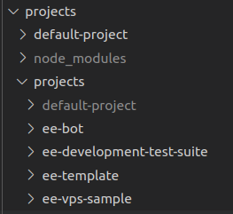
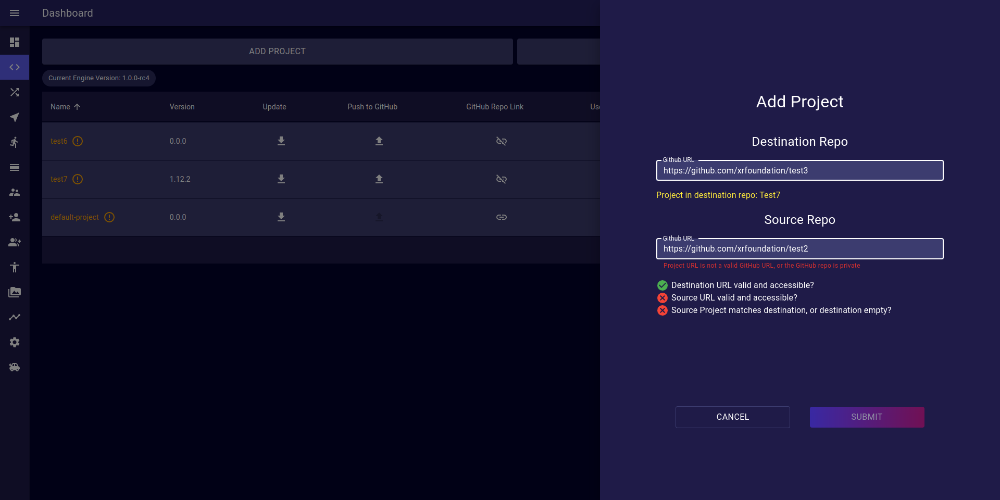
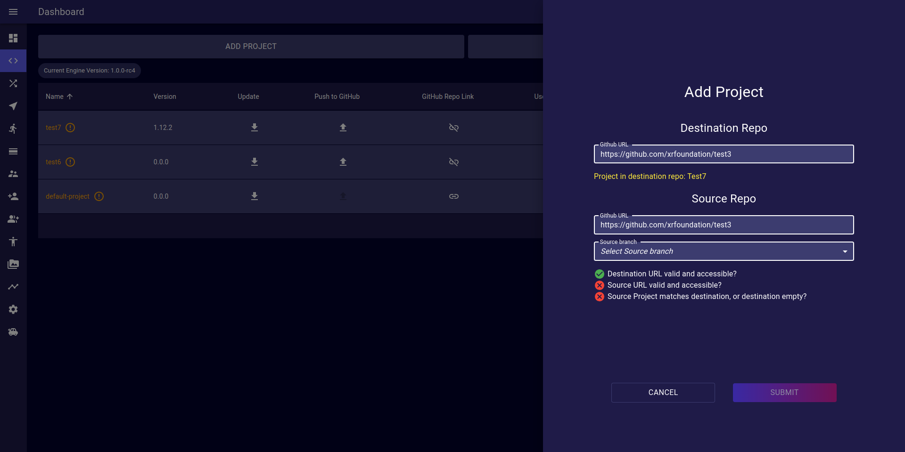
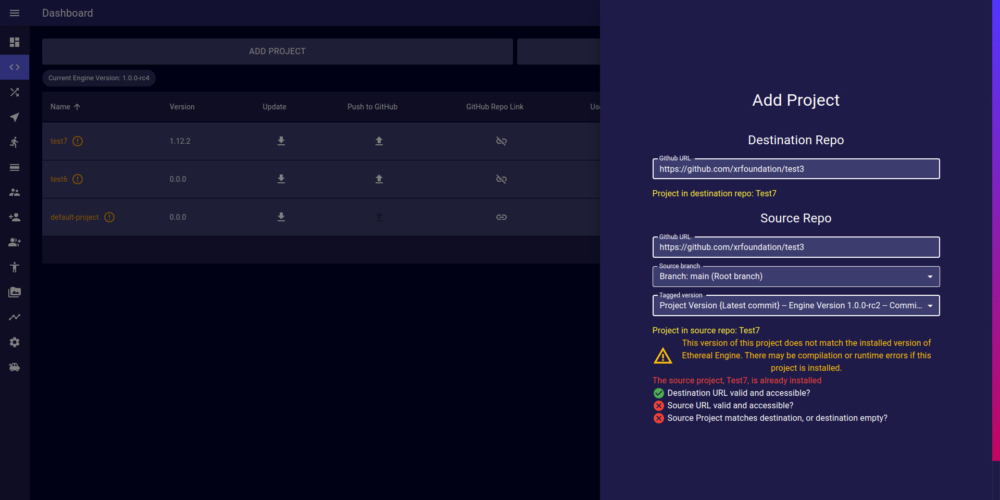
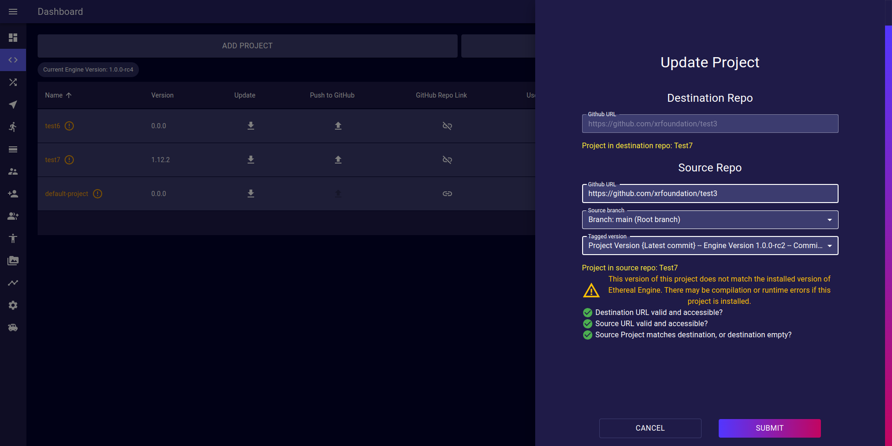
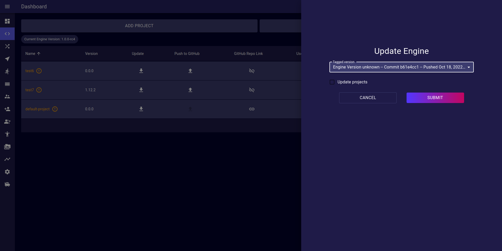

# Projects

Projects are folders that contain all your custom code, assets and scenes. They
are version controlled using git & github, and can be installed to any deployment
with a single click. (more on that in the [next chapter](./2_editor_scenes_locations.md))

Pictured below is an example of 4 projects installed. By default, only the 
`default-project` is installed, which in a production environment is read only.
You can find the default project under `/packages/projects/default-project/`

In a production environment, the builder process will install all projects
according to the `project` database table and will download files from the
storage provider. In a local development environment, the local file system is
always the source of truth. Any project folders added or removed from the file
system will be automatically added or removed from the database. This is to
ensure there is no accidental loss of data, as these project folders are all git
repositories.



## Configuration

Projects have a few conventions.

- `assets/` is where files uploaded from the editor will be uploaded to

- `src/` is where code assets can be served from

- `tests/` is where test files can be run

- `sceneName.scene.json` is a scene file

- `sceneName.thumbnail.png` is an auto-generated scene thumbnail file

- `xrengine.config.ts` the project configuration, where client routes, database 
  models, feathers services and the project thumbnail can be defined

A project must also have a package.json to provide custom dependencies, and to define
the project name, project version, and Ethereal Engine version it is known to work with.

Systems imported from a scene MUST have their filename end with `System.ts` and be in the `/src/systems` folder.
This is to optimize vite's code-splitting bundling process, as each potentially dynamically
importable file will result in a new bundle with it's own copy of all of it's import dependencies.

`@etherealengine/*` monorepo dependencies will be symlinked and not needed, but some
package managers (such as pnpm) require these to be defined. If so, they should
be defined in `peerDependencies` and kept up to date with the current engine version.

## Local Install Flow

To install a project locally, clone the repository you wish to install to the 
`/packages/projects/projects/` folder. You can do this with the follow commands:

```
cd packages/projects/projects/
git clone https://github.com/myorg/myrepo
cd myrepo 
code .
```

This will create a folder name `myrepo` which must contain an `xrengine.config.ts`
file, and open the project in a new vscode window (such that git commands can be 
handled by the new window). All you need to do now to run this project is re-run
the stack (with `npm run dev`).

## Graphical Install Flow

Projects can also be installed and managed from the /admin/projects route. You must be
an admin and must have a linked GitHub account, which can be attained by having your
GitHub account linked to your Ethereal Engine account by signing in via GitHub.
(You do not need to have most recently signed in via GitHub, you just have to have
linked your GH account at some point)

See [the section 'How to set up GitHub to install external projects'](../2_devops_deployment/4_setup_github_oauth_for_projects.md)
for instructions on creating an OAuth app from GitHub, installing it into an Ethereal Engine deployment,
and authorizing it to have access to your GitHub organizations.

Click the 'Add Project' button:


You will see text fields for entering the source and destination repositories.
When you click away from the text fields, the URL will be checked both for the
repository existing, and for whether you have sufficient permission to access
that repository - read permission for the source repo (public repositories are
always available), and write or admin permission for the destination repo. If
you have never logged into GitHub with your current account, you will not be
allowed to add or update projects.



For the source repository, after entering the URL, you will also need to select
a branch to pull from. Your options are either the main branch for that repository,
or a branch that matches the `RELEASE_NAME` of the deployment, e.g. `dev-deployment` for
a deployment with the environment variable `RELEASE_NAME=dev`. If `RELEASE_NAME` is not defined, then
`local` is used; this could lead to multiple local installations of the platform conflicting,
but one can set `RELEASE_NAME` locally to something else in your .env.local file.



After the branch is selected, you also need to select a tagged commit from that branch, 
or the most recent commit. As of this writing, you must manually tag project commits yourself, 
though tags are copied over from the source repository when installing or updating a project.


The backend checks that the source and destination repos have the same project.
The project name is the `name` field in the project's package.json file.
If the destination repo's `<RELEASE_NAME>-deployment` branch is empty or nonexistent, then
any project can be uploaded to it. If the destination deployment branch is not empty,
then it can only be updated with different versions of that project. For example,
if the destination branch has project `example1` in it, you will not be allowed to
overwrite it with a project `test3`, only other projects named `example1`.


You can only install a project with a given name once, and names are **case-insensitive**;
`example1` is seen as the same name as `ExamplE1`. You would need to remove an existing project
in order to install a different project that has the same name, or rename one of the projects.



When everything is valid, you will be able to click the Submit button, which will install
the project.


Adding a project through this interface runs `git clone` in the background, same as above, 
but will then upload all of the repository's files to the storage provider. These files will then be 
downloaded and installed to the deployment's file system each time the docker builder 
pod runs. This allows full version controlled access for local development flow
and version locking for production deployment. The source project code will then be force-pushed
to the branch `<RELEASE_NAME>-deployment`, so make sure that there is no work in that branch
that might get overwritten, and make a backup in another branch you do want to save it.

The Push to GitHub button will push the current code for that project to the `<RELEASE_NAME>-deployment`
branch if possible; it will *never* push to the main branch. If there are merge conflicts, it will instead 
make a Pull Request on that branch with the changes; it will NOT force-push anything to this branch, 
unlike adding or updating a project.

The Update button opens the same drawer as adding a new project, just with the destination repository locked in.
Assuming everything matches, it will also force-push to the `<RELEASE_NAME>-deployment` branch in the destination
repository.



The GitHub Repo Link button also opens this drawer, but you can only select the destination repository, not
the source repository, and no code is pushed anywhere. 

The remove button will remove the folder containing that project. This will not delete the deployment
branch. WARNING: Any uncommitted & unpushed files will be lost.

### Updating the Engine Version and Rebuilding Projects

Making changes to a project is not always reflected immediately in the running code. As of this writing,
project code is built into the client-side and backend files, and changes to project code require that
the codebase be updated. Locally, this just requires you to stop and restart the `npm run dev` command.
In a production environment, this requires that the builder process be restarted, so that it can
rebuild the client and backend code with the new project code.

Changes to scenes in projects do not require a rebuild - since they are stored external to the codebase
in the storage provider, and are downloaded anew by a client each time the scene is loaded, changes to 
scenes will always be immediately available. The act of saving a project will clear any cached version
of the scene's static files, so the client will get the new version.

Additionally, if you want to update the core Ethereal Engine code, you will also need to re-run the builder
process with the new version of the code.

In a production environment, click on the button `Update Engine/Rebuild`. A drawer will open with
a selector for the engine version you want to update with. This will be an image in the builder's
linked image repository.


After selecting an engine version, if you click Submit now, you will just rebuild with the 
newly-selected version of the main codebase, plus whatever versions of your projects are currently 
in your linked repositories.



If you click on `Update projects`,
you can select the source commits for any installed projects that have a destination repo, same as with
the Add/Update project drawer. The projects will be updated before the builder is restarted.


## Config

The ethereal engine config file has the following options:

```ts
export interface ProjectConfigInterface {
  onEvent?: string
  thumbnail?: string
  routes?: {
    [route: string]: {
      component: () => Promise<{ default: (props: any) => JSX.Element }>
      props?: {
        [x: string]: any
        exact?: boolean
      }
    }
  }
  webappInjection?: () => Promise<{ default: (props: any) => void | JSX.Element }>
  worldInjection?: () => Promise<{ default: () => Promise<void> }>
  services?: string
  databaseSeed?: string
  settings?: Array<ProjectSettingSchema>
}
```

### Hooks
The `onEvent` property is a relative path string that points to a file which 
must expose an object with properties as follows:

```ts
export interface ProjectEventHooks {
  onInstall?: (app: Application) => Promise<any>
  onLoad?: (app: Application) => Promise<any>
  onUpdate?: (app: Application) => Promise<any>
  onUninstall?: (app: Application) => Promise<any>
  /**
   * get oEmbed for active routes that match URL
   * return that project's onOEmbedRequest()
   * if null, return default
   */
  onOEmbedRequest?: (app: Application, url: URL, currentOEmbed: OEmbed) => Promise<OEmbed | null>
}
```

These functions are called when the project they belong to are installed, 
updated (such as scenes saved) or uninstalled respectively. This is used in the 
default ethereal engine project to install the default avatars. 
See `/packages/projects/default-project/projectEventHooks.ts`.

### Thumbnail

This is a URL to a thumbnail for the project.

### Routes

Routes enable users to customise the various URL paths of their website 
utilising dynamic loading of modules. The key of each object represents the path 
(with leading forward slash included) while the value represents a react 
component object which gets wrapped in `React.lazy()` and a props object which 
passes options into the react-dom-router Route component corresponding to the route.

### Webapp Injection
Webapp injection allows logic to be run on all pages, loaded before any routes 
are loaded. This will soon be extended to allow easy stylesheet injection and 
other configurables of the webapp.

### World Injection

World injection allows logic to be run every time a new world is created, 
currently only when the engine is initialised. This is loaded on all instances 
of the engine, such as a location and the editor. An example use case of this 
would be registering custom scene loader and editor prefabs.

### Services

The `services` property is a relative path that points to a file which must 
return type `((app: Application) => Promise<any>)[]` which is run on all 
instanceservers and api servers at startup. This allows users to expose custom 
Feathers services, or whatever other functionality they made need.

### Database Seeding

The `databaseSeed` property is a relative path that points to a file which must 
return type `ServicesSeedConfig` from `../packages/common/src/interfaces/ServicesSeedConfig.ts`
which is run when the database seeder is run. This can be useful for setting 
custom locations, which can be seen in the 
[Ethereal Engine demo project](https://github.com/etherealengine/demo-etherealengine-project).

### i18n

Internationalization can be added using the pattern `./i18n/<language>/<namespace>.json`. An example of the format can be found in [the base i18n files](https://github.com/etherealengine/etherealengine/tree/dev/packages/client-core/i18n).
