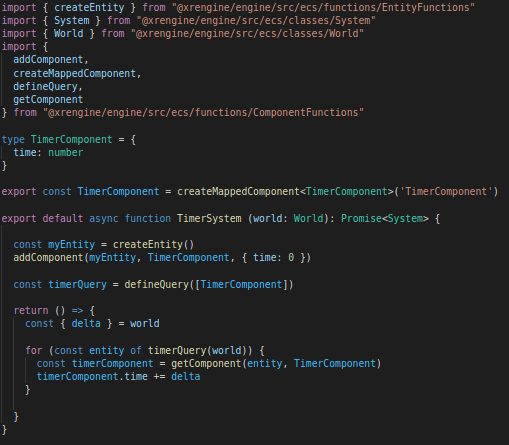

# Entity Component System

## What is an ECS?

ECS stands for Entity Component System. It is a pattern for organising data and objects that allows for composition over inheritance. An entity is simply a number that points to a particular set of data contained in components. Systems then operate logic on these entities and components.

Some references
- [Entity Component System Overview in 7 Minutes](https://www.youtube.com/watch?v=2rW7ALyHaas)
- [Entity Component System in TypeScript with Phaser 3 and bitECS)](https://www.youtube.com/watch?v=qaY_CKvFLYM)
- [Overwatch GDC ECS & Netcode](https://www.youtube.com/watch?v=W3aieHjyNvw) (note, ethereal engine does not use this style of network)

### Example



This code creates a TimerComponent, creates a new entity and adds the component to it, creates a system that will then add the world delta for the current frame each update.

## Update Loop

The engine uses a very similar model to Unity's update loop (found here https://docs.unity3d.com/Manual/ExecutionOrder.html). It has a frame update, called once per frame, of which inside is a fixed update, which operates on an accumulator system. This system ensures a stable number of updates per second independent of the framerate. This means it may have 0 to many updates in a given frame. 

## Ethereal Engine ECS API

### The World

..

### Systems

..

### API

[Component Functions](https://raw.githubusercontent.com/etherealengine/etherealengine/dev/packages/engine/src/ecs/functions/ComponentFunctions.ts)


### Examples

This example uses 'Structure of Arrays' (SoA) data structures with bitECS syntax.

```ts
export const TimerComponent = defineComponent({
  name: 'TimerComponent',
  schema: {
    time: Types.f32
  }
})

export default async function TimerSystem() {

  const myEntity = createEntity()
  setComponent(myEntity, TimerComponent)

  const timerQuery = defineQuery([TimerComponent])

  return () => {
    const { delta } = Engine.instance

    for (const entity of timerQuery()) {
      TimerComponent.time[entity] += delta
    }

  }
}

```

This example uses 'Array of Structures' syntax, with reactive data binding.

```ts
const MockComponent = defineComponent({
  name: 'MockComponent',
  onInit: (entity) => {
    return {
      mockValue: 0
    }
  },
  onSet: (entity, component, json: { mockValue: number }) => {
    if (typeof json?.mockValue === 'number') component.mockValue.set(json.mockValue)
  },
  toJSON: (entity, component) => {
    return {
      mockValue: component.mockValue.value
    }
  }
})

export default async function TimerSystem() {

  const myEntity = createEntity()
  setComponent(myEntity, TimerComponent)

  const timerQuery = defineQuery([TimerComponent])

  return () => {
    const { delta } = Engine.instance

    for (const entity of timerQuery()) {
      const timerComponent = getMutableComponent(entity, TimerComponent)
      timerComponent.time.set(timerComponent.time.value + delta)
    }

  }
}
```
