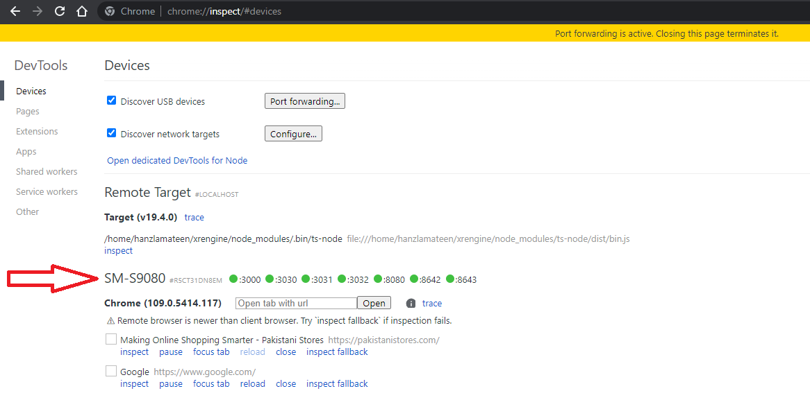
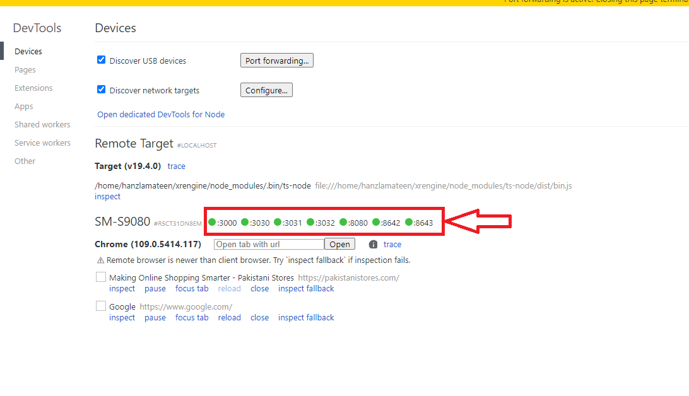
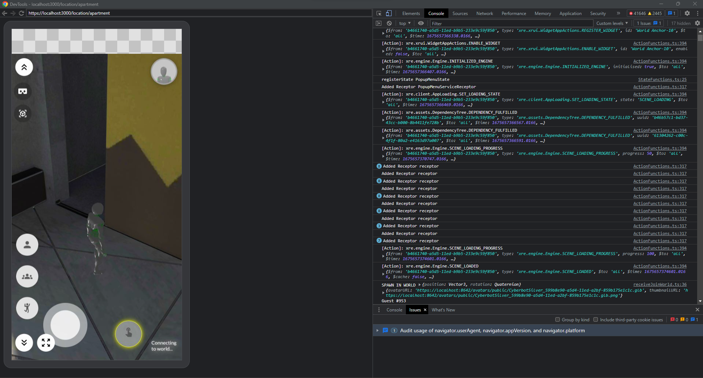

# Debugging Engine in WSL on Mobile

This section covers testing/debugging on mobile when engine stack hosted in WSL2 Ubuntu on Windows 11.

1. Ensure that your `.env.local` and database entries points to `localhost`.

2. Open a location i.e. `https://localhost:3000/location/apartment` through Windows 11 chrome. It should work fine.

3. Connect your Mobile (currently tested on Samsung S22 Ultra) with PC and enabled USB debugging and access prompts as mentioned on <https://developer.chrome.com/docs/devtools/remote-debugging/>

4. Once your phone is connected, then you can see your mobile's browser tabs in PC's Chrome as show in below image. `chrome://inspect/#devices`

5. Make sure the check boxes marked in below are checked.

6. Click on "Port forwarding" button and ensure you have entries as shown in below image. Also make sure to check the port forwarding checkbox in that modal.

7. Once this is done and you have Port forwardings having green circles before them which means forwarding is working as shown in below image.

8. Navigate to `https://localhost:3000/location/apartment` in your mobile's browser.

9. On your PC you can inspect this and allow if you face any certificate errors as shown in below image.

